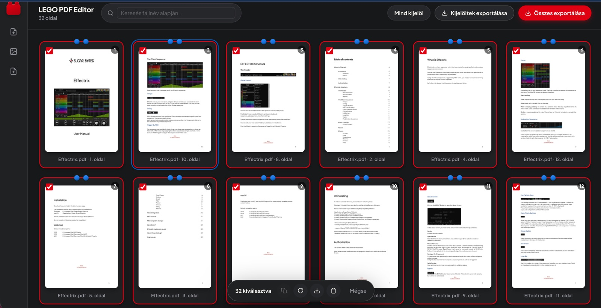
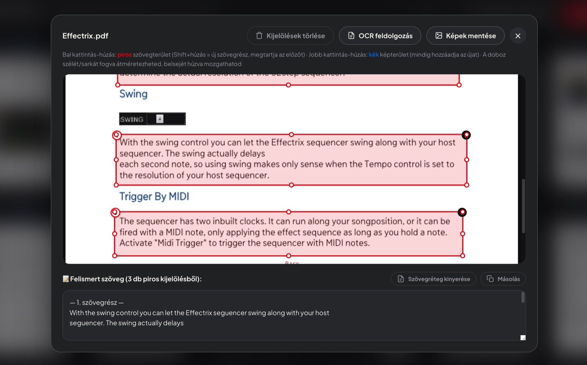
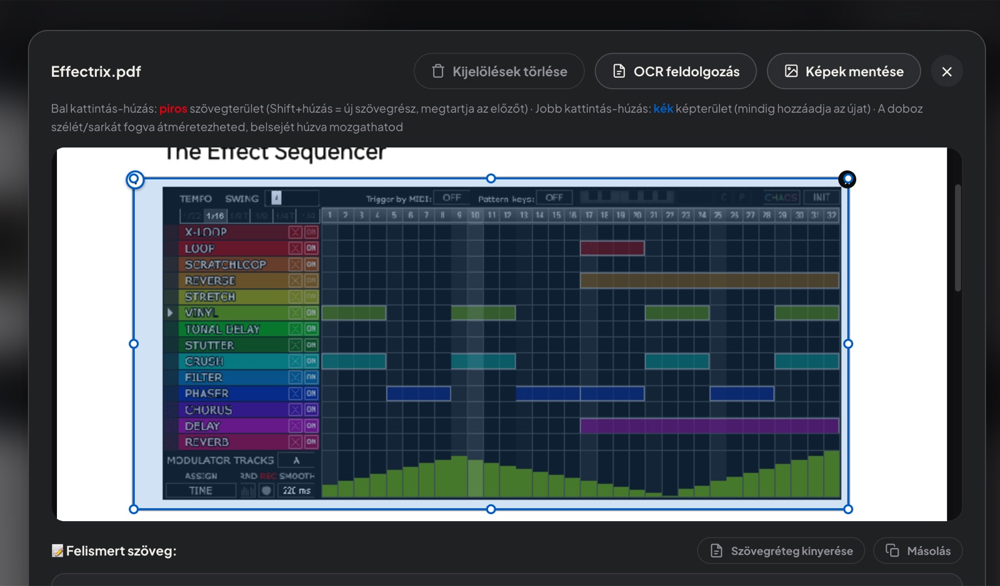
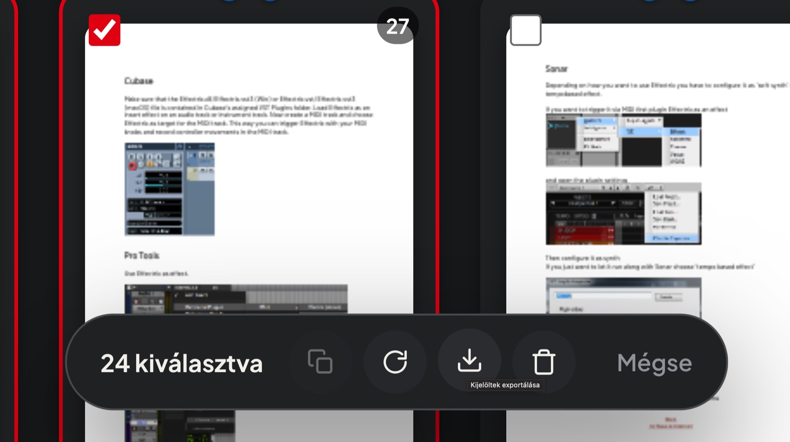
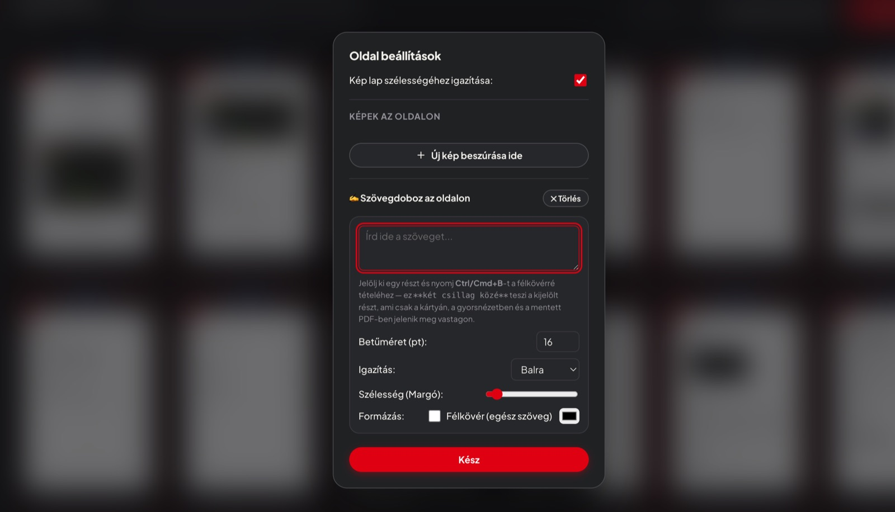

# LEGO PDF Editor

**Építs új PDF-et kockánként, meglévő oldalakból – közvetlenül a böngésződben.**

🌐 **Weboldal:** https://ekidio.github.io/legopdf/
▶️ **Alkalmazás indítása:** https://ekidio.github.io/legopdf/app/



A PDF LEGO egy modern, böngészőben futó webes alkalmazás, amellyel gyorsan és egyszerűen állíthatsz össze új dokumentumokat meglévő PDF-fájlokból. Nincs telepítés, nincs regisztráció, és a fájljaid nem töltődnek fel sehova – minden a saját gépeden történik.

## Funkciók

- **Több PDF egyszerre** – tetszőleges számú PDF feltöltése, az oldalak automatikus kinyerése. Kép és üres lap is beszúrható.
- **Drag and drop** – kártyás nézetben az oldalak sorrendje pillanatok alatt átrendezhető.
- **Oldalműveletek** – forgatás, duplikálás, törlés egyenként vagy csoportosan, visszavonással.
- **QuickLook** – a kijelölt oldalakon a `Szóköz` lenyomásával nagy felbontásban ellenőrizheted a tartalmat.
- **Szöveg- és képkivágás** – QuickLookban szövegdobozokat (`Shift` + bal egér) és képdobozokat (jobb egér) jelölhetsz ki; a szöveget OCR-rel (magyarul is) kinyerheted, a képeket ZIP-ben mentheted.
- **Export** – az összes vagy csak a kijelölt oldalak mentése egyetlen új PDF-be.
- Sötét / világos téma, állítható kártyaméret.

## Billentyűparancsok

| Művelet | Billentyű |
| --- | --- |
| QuickLook a kijelölt oldalakon | `Szóköz` |
| Szövegterület kijelölése (QuickLook) | `Shift` + bal egér |
| Képterület kijelölése (QuickLook) | jobb egér |
| Összes oldal kijelölése | `Ctrl/Cmd` + `A` |
| Kijelölt oldalak törlése | `Delete` / `Backspace` |
| Utolsó törlés visszavonása | `Ctrl/Cmd` + `Z` |
| Ablak bezárása / kijelölés megszüntetése | `Esc` |

## Képernyőképek

| | |
| --- | --- |
|  |  |
|  |  |

## Helyi futtatás

Az alkalmazás egyetlen HTML-fájl: töltsd le az [`app/index.html`](app/index.html) fájlt, és nyisd meg böngészőben. Internetkapcsolat szükséges a CDN-ről betöltött könyvtárakhoz.

## Projektstruktúra

```
index.html          bemutató oldal (GitHub Pages kezdőlap)
app/index.html      maga az alkalmazás
assets/screenshots/ képernyőképek
```

## Felhasznált könyvtárak

[PDF.js](https://mozilla.github.io/pdf.js/) · [pdf-lib](https://pdf-lib.js.org/) · [SortableJS](https://sortablejs.github.io/Sortable/) · [Tesseract.js](https://tesseract.projectnaptha.com/) · [JSZip](https://stuk.github.io/jszip/)
